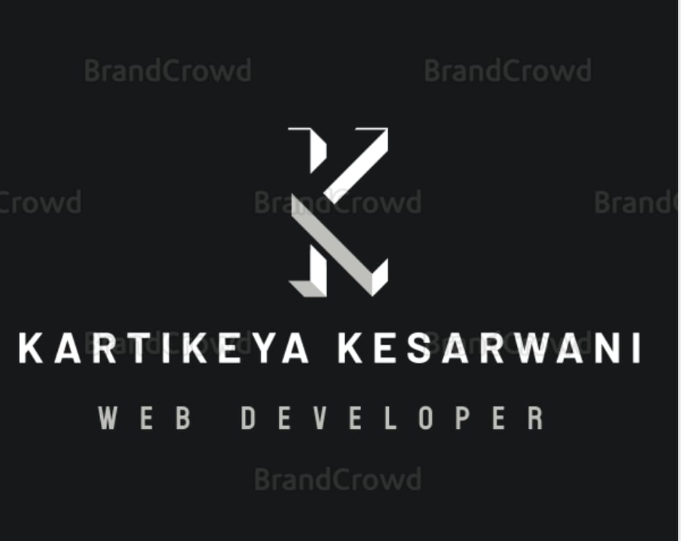

# 💻 Kartikeya Kesarwani - Front-End Developer Portfolio

Welcome to my interactive portfolio website showcasing my skills, projects, and professional information as a front-end developer.

## 🌟 Features

- **Modern UI** with sleek animations
- **Interactive elements** with hover effects
- **Skills visualization** using animated circular progress bars
- **Project showcase** with smooth scroll animations
- **Responsive contact section**

## 🛠 Tech Stack

| Front-End       | Animations      | Icons           |
|-----------------|-----------------|-----------------|
|  |  |  |
|  |  |  |
|  |  |  |

## 🚀 Projects Showcased

1. **Glassmorphism Login Page** - Modern UI design
2. **Spotify Player Clone** - Music player interface
3. **Rock Paper Scissors Game** - Interactive game
4. **To-Do List App** - Task management
5. **Simon Says Game** - Memory challenge game

## 🏆 Skills

## 📬 Contact Me

  

  
📧 kartikeyakesarwani@gmail.com  
📞 +91 7985557595

## 📜 License

This project is open source and available under the [MIT License](LICENSE).

---

⭐ Feel free to explore the code and get inspired!
